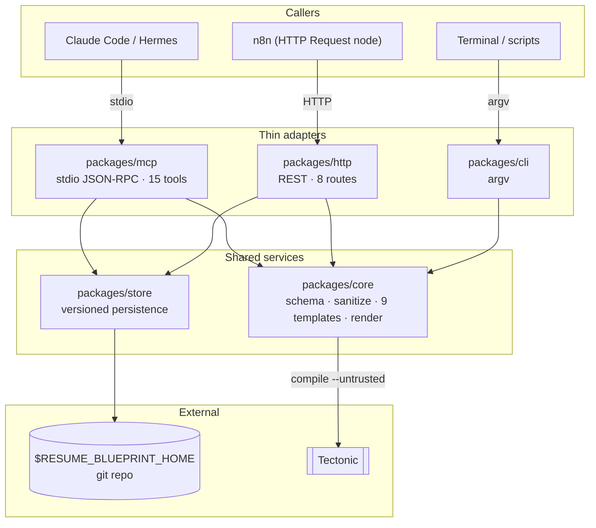
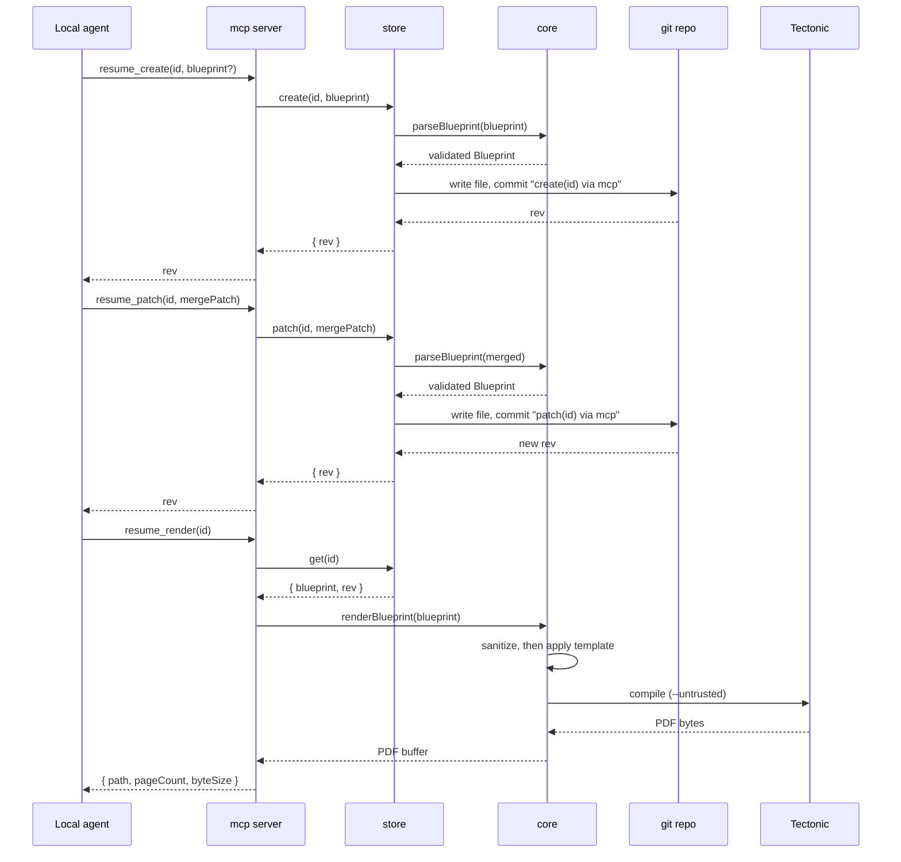

# resume-blueprint

A local-first resume service: a validated JSON blueprint goes in, a typeset PDF comes out.

Built by extracting the nine LaTeX template generators from the retired
[resumake.io](https://github.com/saadq/resumake.io) project and rebuilding them as a
pure, UI-free package that agents and workflows can call.

## Status

**Phase 1 and Phase 2 complete.** Core, CLI, the git-backed blueprint store, the MCP
server, and the HTTP adapter all work end to end, over an unchanged core:

- `packages/core` — schema, sanitizer, nine templates, Tectonic renderer
- `packages/cli` — thin argv wrapper over core
- `packages/store` — versioned, git-backed blueprint persistence
- `packages/mcp` — stdio MCP server (15 tools) for local agents (Claude Code, Hermes)
- `packages/http` — REST adapter (8 routes) for workflow tools such as n8n

## Requirements

- Node.js >= 20
- [Tectonic](https://tectonic-typesetting.github.io/) on `PATH` — `brew install tectonic`
- `pdftotext` from poppler, for the parse-fidelity tests only — `brew install poppler`.
  Without it those tests skip; everything else runs.

Tectonic is used instead of a full TeX Live install because it is a single ~30MB binary
that fetches only the packages a document actually needs. The first render of a given
template downloads those packages and caches them; later renders are offline and take
well under a second.

## Quick start

```bash
npm install
npm run build

node packages/cli/dist/index.js render fixtures/sample.json -t 3 -o ada.pdf
```

## CLI

```
resume render <blueprint.json> [-t N] [-o out.pdf]   Render to PDF
resume tex    <blueprint.json> [-t N] [-o out.tex]   Emit LaTeX source
resume validate <blueprint.json>                     Validate, with readable errors
resume list-templates                                List template IDs
```

Pass `-` as the path to read the blueprint from stdin. Without `-o`, output goes to stdout.

## Running the protocols

Both adapters read and write the same store, `$RESUME_BLUEPRINT_HOME` (default
`~/.resume-blueprint`), which is created and `git init`ed on first use.

### MCP (local agents)

`.mcp.json` in this repo registers the server for Claude Code at project scope, so
opening the project and approving the server is all that's needed. For another client,
the equivalent entry is:

```json
{
  "mcpServers": {
    "resume-blueprint": {
      "command": "node",
      "args": ["packages/mcp/dist/index.js"]
    }
  }
}
```

Fifteen tools: `resume_list`, `resume_get`, `resume_create`, `resume_patch`,
`resume_section_append`, `resume_section_update`, `resume_section_remove`,
`resume_remove`, `resume_validate`, `resume_render`, `resume_tex`, `resume_history`,
`resume_diff`, `resume_revert`, `resume_templates`.

### HTTP (workflow tools)

```bash
npm run start:http     # 127.0.0.1:8787
```

| Route | Purpose |
|---|---|
| `POST /render` | Stateless: blueprint in, `application/pdf` out |
| `GET /blueprints` | List stored blueprints |
| `POST /blueprints` | Create — `{ id, blueprint }` |
| `GET /blueprints/:id` | Fetch one, with its rev |
| `PATCH /blueprints/:id` | Merge-patch — `{ patch, expectedRev? }` |
| `DELETE /blueprints/:id` | Remove |
| `POST /blueprints/:id/render` | Render a stored blueprint to `application/pdf` |
| `GET /healthz` | Liveness, exempt from auth |

`RESUME_BLUEPRINT_PORT` and `RESUME_BLUEPRINT_BIND` override the defaults. Auth is off
until `RESUME_BLUEPRINT_TOKEN` is set; once set, every route but `/healthz` requires
`Authorization: Bearer <token>`. Binding anything other than loopback is a deliberate
opt-in — treat the token as mandatory if you do.

## Library

```ts
import { renderBlueprint, blueprintToTex, parseBlueprint } from '@resume-blueprint/core'

const pdf = await renderBlueprint(blueprint)   // Buffer
const { texDoc } = blueprintToTex(blueprint)   // LaTeX source
```

`renderBlueprint` and `blueprintToTex` both validate and sanitize before touching a
template. Prefer them over calling `getTemplateData` directly — they are what guarantee
the document handed to the engine has been escaped.

## The blueprint format

[JSON Resume](https://jsonresume.org) plus a few extensions the templates consume.
See `fixtures/sample.json`. Every field is optional; validation checks structure and
types, while blank values are pruned rather than rejected, so an agent can build a
blueprint up incrementally.

`work[].company` is accepted as an alias for `work[].name`.

## Architecture

The rule that keeps this extensible: **core knows nothing about MCP, HTTP, or argv.**
`store` persists blueprints and knows nothing about MCP or HTTP either. Every interface —
CLI, MCP, HTTP — is a thin adapter over the same call path, and only `store`/`core` ever
touch the filesystem, git, or Tectonic.



`packages/cli` renders a blueprint it's handed directly — it has no store dependency, by
design; persistence is `store`'s job, not the CLI's. `fixtures/` holds sample + adversarial
blueprints and golden `.tex` snapshots used across every package's test suite.

## Workflow

An agent's typical session — create a blueprint, edit it over time, render it — shown here
through MCP; the same shape holds over HTTP or when calling `store`/`core` as a library. The
sequence is also the load-bearing example for this project's two invariants: **every
mutation is validated before it's committed**, and **content is stored raw — sanitizing
happens only on the way to Tectonic, never on the way to disk.**



Every `create`/`patch`/`section*`/`revert` call is one git commit — `history`/`diff`/`revert`
are free, and a bad edit (an agent's or a human's) is always recoverable. `resume_render`
never returns PDF bytes over MCP: stdout is the JSON-RPC transport, so the response is a
path plus `{pageCount, byteSize}`, and the agent reads the file itself if it needs to.

## Security

Blueprint content may be written by an LLM or scraped from a job posting, and it is
interpolated into a document handed to a TeX engine. TeX is a programming language:
unescaped, `\input{/etc/passwd}` reads a local file into the rendered PDF and
`\write18{...}` shells out.

Two layers address this:

1. **`sanitize.ts`** escapes every LaTeX special character in a single pass, so injected
   commands typeset as visible literal text rather than executing. URLs get separate
   handling — validated through the URL parser, restricted to http/https/mailto, and
   escaped so they stay valid in both `\href` arguments.
2. **The renderer passes `--untrusted`**, which disables shell-escape and other
   known-insecure engine features.

`fixtures/injection.json` exercises this, and the test suite asserts that no payload
survives into the generated TeX and that nothing executes during a real compile.

## Tests

```bash
npm test
```

Covers the sanitizer, golden `.tex` snapshots for all nine templates, a real compile of
each with page-count assertions, and the adversarial fixture. After an intentional change
to template output:

```bash
npm run test:update-golden --workspace @resume-blueprint/core
```

## Notes on the extraction

Fixed while porting, all present in the upstream `v2` branch:

- **Employer names never rendered.** The form wrote `work[].company`; all nine templates
  read `work[].name`. Now aliased in the schema and asserted in tests.
- **No input sanitization existed.** The 2022 server had it; the 2024 rewrite dropped it,
  leaving only `// TODO: validate using Zod` comments.
- **template9 used `\textheight=700px`.** `px` is a pdfTeX-only unit that XeTeX-derived
  engines reject. Changed to the identical `700bp`.
- **template9 enabled microtype font expansion**, which is also pdfTeX-only. Protrusion
  stays on; expansion is off.
- **template7 vendored a partial, 2013-era moderncv.** Staging only some of the package
  meant LaTeX resolved the rest from Tectonic's bundle and hit a version clash. The
  bundle now supplies moderncv in full.

Also fixed on the same branch as the parse-fidelity harness, and the same bug class as
`work[].company`: every template's header destructured only
`{ name, email, phone, location, website }`, so `basics.label` and `basics.summary` were
validated, stored, and silently dropped. `work[].summary` was accepted and rendered by no
template at all. All three now render everywhere.

## Credits

The LaTeX templates come from resumake.io by Saad Quadri (MIT), which in turn credits
Rensselaer CDC, Byungjin Park, Scott Clark, Debarghya Das, Xavier Danaux, Ratul Saha,
Daniil Belyakov, and Frits Wenneker.

## License

MIT
