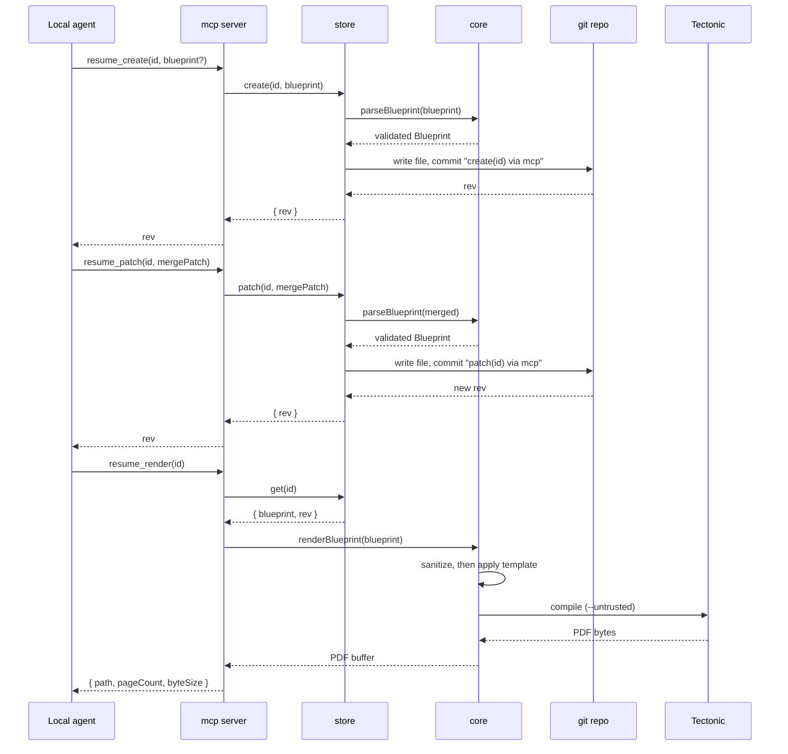

# resume-blueprint

A local-first resume service: a validated JSON blueprint goes in, a typeset PDF comes out.

Built by extracting the nine LaTeX template generators from the retired
[resumake.io](https://github.com/saadq/resumake.io) project and rebuilding them as a
pure, UI-free package that agents and workflows can call.

## Status

**Phase 1 and Phase 2 complete.** Core, CLI, the git-backed blueprint store, the MCP
server, and the HTTP adapter all work end to end, over an unchanged core:

- `packages/core` — schema, sanitizer, ten templates, Tectonic renderer
- `packages/cli` — thin argv wrapper over core
- `packages/store` — versioned, git-backed blueprint persistence
- `packages/mcp` — stdio MCP server (18 tools) for local agents (Claude Code, Hermes)
- `packages/http` — REST adapter (8 routes) for workflow tools such as n8n

## Requirements

- Node.js >= 22.6 — the test suite runs `.ts` files directly through Node's type
  stripping, which older releases do not support
- [Tectonic](https://tectonic-typesetting.github.io/) on `PATH` — `brew install tectonic`
- `pdftotext` from poppler, for the parse-fidelity tests only — `brew install poppler`.
  Without it those tests skip locally; in CI a missing `pdftotext` is a failure, because a
  suite that goes green having verified none of the ATS claims is worse than no suite.

Tectonic is used instead of a full TeX Live install because it is a single ~30MB binary
that fetches only the packages a document actually needs. The first render of a given
template downloads those packages and caches them; later renders are offline and take
well under a second.

## Quick start

```bash
npm install
npm run build

node packages/cli/dist/index.js render fixtures/sample.json -t 3 -o ada.pdf
```

## CLI

```
resume render <blueprint.json> [-t N] [-o out.pdf]   Render to PDF
resume tex    <blueprint.json> [-t N] [-o out.tex]   Emit LaTeX source
resume text   <blueprint.json> [-o out.txt]          Emit plain text, honouring sections/headings
resume target <blueprint.json> --jd <job.txt>        Score against a job description
resume validate <blueprint.json>                     Validate, with readable errors
resume import <profile.md> [--strict]                Markdown profile -> blueprint JSON
resume list-templates                                List template IDs
```

Pass `-` as the path to read the blueprint from stdin. Without `-o`, output goes to stdout.

`import` writes the blueprint to stdout and its warnings to stderr, so it pipes:

```bash
resume import profile.md | resume validate -
```

Warnings are not noise — they name every line the parser could not map and every
reading it had to assume (which side of `**A:** B` was the school, whether a `###`
held the employer or the job title). `--strict` exits 1 when any were raised.

`target` scores the blueprint against a job description and reports only — it never
edits anything:

```bash
$ resume target blueprint.json --jd fixtures/job-description.md --max-terms 10
coverage 30%  (3 of 10 terms present)

missing, most prominent first:
  infrastructure             3x  -> skills
  Senior Platform Engineer   2x  -> work
  product                    2x  -> skills
  Senior                     2x  -> skills
  production                 2x  -> skills
  services                   2x  -> skills
  AWS Certified Solutions    1x  -> skills

present:
  Platform -- profile, work, skills
  Engineer -- profile, work
  Kubernetes -- work, skills

note: reporting the top 10 of 82 terms by prominence
```

Terms are ranked by prominence in the posting — how often it says them, how early,
and whether they sit on a requirements bullet. The arrow is where the term would go,
narrowed to sections this blueprint actually renders, which is why the certification
above points at `skills`: that blueprint has no `certificates` section to put it in.

A present term that matched through the plural fold says so — `microservices (as
"microservice")` — so a fold you disagree with is visible rather than silent.

`--jd -` reads the posting from stdin, and `--json` emits the full report (every
suggestion, not just the first) for piping into something else.

`validate`, `tex`, and `render` warn separately about leftover `[cite: 1, 2, 3]`
placeholders anywhere in a blueprint:

```
$ resume validate blueprint.json
blueprint is valid
warning: citation artifacts at 2 sites; these typeset as literal text
  basics.summary carries 1 citation artifact
  work[0].highlights[0] carries 1 citation artifact
```

The importer strips these, so an imported blueprint is clean. This catches the ones
that arrive another way — hand-edited JSON, or an agent that parsed a profile itself
instead of calling `import`. Nothing is rewritten: a placeholder is legal content, so
the blueprint stays valid and `--strict` is what turns the warning into a gate.

## Running the protocols

Both adapters read and write the same store, `$RESUME_BLUEPRINT_HOME` (default
`~/.resume-blueprint`), which is created and `git init`ed on first use.

### MCP (local agents)

`.mcp.json` in this repo registers the server for Claude Code at project scope, so
opening the project and approving the server is all that's needed. For another client,
the equivalent entry is:

```json
{
  "mcpServers": {
    "resume-blueprint": {
      "command": "node",
      "args": ["packages/mcp/dist/index.js"]
    }
  }
}
```

Eighteen tools: `resume_list`, `resume_get`, `resume_create`, `resume_patch`,
`resume_section_append`, `resume_section_update`, `resume_section_remove`,
`resume_remove`, `resume_validate`, `resume_render`, `resume_tex`, `resume_text`,
`resume_target`, `resume_history`, `resume_diff`, `resume_revert`, `resume_templates`,
`resume_import`.

`resume_import` takes the markdown itself, not a path — the agent already has file
tools, and no tool on this server reads a caller-supplied path. It stores nothing;
pass its `blueprint` to `resume_create` once its `warnings` look acceptable.

`resume_text` renders plain text rather than LaTeX — the same `sections`/`headings`
control fields, but no template or document config, and no LaTeX escaping: it's meant
to be pasted into a portal that demands plain text, not typeset.

`resume_target` scores a stored blueprint against a job description: which of the
posting's terms the resume already covers, which are missing and how prominent each is,
and which section each missing term would fit. It is read-only by design — the agent
decides what to change and applies it through `resume_patch` or
`resume_section_append`, so the edit lands in the blueprint's git history rather than
in a tool's side effect.

`resume_validate`, `resume_render`, `resume_tex`, `resume_text`, and `resume_target`
carry an optional
`warnings` array reporting leftover `[cite: …]` placeholders in the content, present only when
there are any. `resume_validate` still returns `valid: true` — a placeholder is legal
content, not a schema violation.

**Dev loop: rebuild, then restart the server.** A running server holds
`@resume-blueprint/core` in module memory, so after `npm run build` it keeps rendering
the templates it loaded at startup until the client restarts it. Nothing can reload an
ESM graph in place, so the staleness is made visible instead: the server prints its core
build to stderr on start, and every `resume_render` result carries the same stamp.

```
[resume-blueprint-mcp] ready (core built 2026-08-18T03:30:45.795Z)
```

If a template change appears not to have worked, compare that timestamp against
`packages/core/dist/index.js` before looking anywhere else.

### HTTP (workflow tools)

```bash
npm run start:http     # 127.0.0.1:8787
```

| Route | Purpose |
|---|---|
| `POST /render` | Stateless: blueprint in, `application/pdf` out |
| `GET /blueprints` | List stored blueprints |
| `POST /blueprints` | Create — `{ id, blueprint }` |
| `GET /blueprints/:id` | Fetch one, with its rev |
| `PATCH /blueprints/:id` | Merge-patch — `{ patch, expectedRev? }` |
| `DELETE /blueprints/:id` | Remove |
| `POST /blueprints/:id/render` | Render a stored blueprint to `application/pdf` |
| `GET /healthz` | Liveness, exempt from auth |

`RESUME_BLUEPRINT_PORT` and `RESUME_BLUEPRINT_BIND` override the defaults. Auth is off
until `RESUME_BLUEPRINT_TOKEN` is set; once set, every route but `/healthz` requires
`Authorization: Bearer <token>`. Binding anything other than loopback is a deliberate
opt-in — treat the token as mandatory if you do.

## Library

```ts
import {
  renderBlueprint,
  blueprintToTex,
  blueprintToText,
  analyzeCoverage,
  parseBlueprint,
  profileToBlueprint
} from '@resume-blueprint/core'

const pdf = await renderBlueprint(blueprint)   // Buffer
const { texDoc } = blueprintToTex(blueprint)   // LaTeX source
const plain = blueprintToText(blueprint)       // plain text, unescaped

// Reports only. Never rewrites the blueprint, never sanitizes: this output
// reaches a reader, not a TeX engine.
const report = analyzeCoverage(blueprint, jobDescription)

// Markdown master profile in, blueprint out. Takes a string, not a path:
// core does no I/O it was not handed.
const { blueprint: imported, warnings } = profileToBlueprint(markdown)
```

`renderBlueprint` and `blueprintToTex` both validate and sanitize before touching a
template. Prefer them over calling `getTemplateData` directly — they are what guarantee
the document handed to the engine has been escaped.

## The blueprint format

[JSON Resume](https://jsonresume.org) plus a few extensions the templates consume.
See `fixtures/sample.json`. Every field is optional; validation checks structure and
types, while blank values are pruned rather than rejected, so an agent can build a
blueprint up incrementally.

`work[].company` is accepted as an alias for `work[].name`.

## Choosing a template

`resume list-templates` (and the `resume_templates` MCP tool) prints this:

| # | Built on | ATS-grade | Note |
|---|---|---|---|
| 1 | Classic (article) | yes | |
| 2 | Awesome CV | no | FontAwesome contact labels |
| 3 | Compact (article) | yes | |
| 4 | Deedy | yes | |
| 5 | res.cls | yes | |
| 6 | Minimal | yes | |
| 7 | ModernCV (banking) | no | moderncv icon contact labels |
| 8 | McDowell | yes | |
| 9 | Contrast (article) | yes | |
| 10 | Word-alike (article) | yes | Calibri/11pt/0.75in/1.15 spacing by default |

**ATS-grade is measured, not asserted.** An applicant tracking system never sees the
PDF's layout — it extracts the text layer and parses that. So the test suite renders a
deliberately dense blueprint through every template, extracts the text back with
`pdftotext`, and checks that nothing was clipped mid-string, that every critical field
survived, that the sections come out in the order the blueprint declared, and that name,
email, and phone stay close enough together to read as one contact block. All ten pass.

Templates 2 and 7 fall short on a fifth check. Both label their contact details with
icon-font glyphs rather than words, and those glyphs land in the text layer: template 2's
FontAwesome icons extract as private-use characters (`U+F0E0` and friends), template 7's
moderncv icons as mis-mapped Latin (`U+0232`, `U+0307`). A parser reads a stray token
immediately before the email address, and some will take it as part of the value. Both
still render beautifully — this is a machine-readability cost, not a visual defect. Use
them when a human is the reader.

## Architecture

The rule that keeps this extensible: **core knows nothing about MCP, HTTP, or argv.**
`store` persists blueprints and knows nothing about MCP or HTTP either. Every interface —
CLI, MCP, HTTP — is a thin adapter over the same call path, and only `store`/`core` ever
touch the filesystem, git, or Tectonic.


`packages/cli` renders a blueprint it's handed directly — it has no store dependency, by
design; persistence is `store`'s job, not the CLI's. `fixtures/` holds sample + adversarial
blueprints and golden `.tex` snapshots used across every package's test suite.

## Workflow

An agent's typical session — create a blueprint, edit it over time, render it — shown here
through MCP; the same shape holds over HTTP or when calling `store`/`core` as a library. The
sequence is also the load-bearing example for this project's two invariants: **every
mutation is validated before it's committed**, and **content is stored raw — sanitizing
happens only on the way to Tectonic, never on the way to disk.**



Every `create`/`patch`/`section*`/`revert` call is one git commit — `history`/`diff`/`revert`
are free, and a bad edit (an agent's or a human's) is always recoverable. `resume_render`
never returns PDF bytes over MCP: stdout is the JSON-RPC transport, so the response is a
path plus `{pageCount, byteSize}`, and the agent reads the file itself if it needs to.

## Security

Blueprint content may be written by an LLM or scraped from a job posting, and it is
interpolated into a document handed to a TeX engine. TeX is a programming language:
unescaped, `\input{/etc/passwd}` reads a local file into the rendered PDF and
`\write18{...}` shells out.

Two layers address this:

1. **`sanitize.ts`** escapes every LaTeX special character in a single pass, so injected
   commands typeset as visible literal text rather than executing. URLs get separate
   handling — validated through the URL parser, restricted to http/https/mailto, and
   escaped so they stay valid in both `\href` arguments.
2. **The renderer passes `--untrusted`**, which disables shell-escape and other
   known-insecure engine features.

`fixtures/injection.json` exercises this, and the test suite asserts that no payload
survives into the generated TeX and that nothing executes during a real compile.

## Tests

```bash
npm test
```

571 tests. Covers the sanitizer, golden `.tex` snapshots for all ten templates, a real
compile of each with page-count assertions, the adversarial fixture, the master-profile
importer, job-description coverage, and the parse-fidelity harness described under
[Choosing a template](#choosing-a-template).
After an intentional change to template output:

```bash
npm run test:update-golden --workspace @resume-blueprint/core
```

## Notes on the extraction

Fixed while porting, all present in the upstream `v2` branch:

- **Employer names never rendered.** The form wrote `work[].company`; all nine templates
  read `work[].name`. Now aliased in the schema and asserted in tests.
- **No input sanitization existed.** The 2022 server had it; the 2024 rewrite dropped it,
  leaving only `// TODO: validate using Zod` comments.
- **template9 used `\textheight=700px`.** `px` is a pdfTeX-only unit that XeTeX-derived
  engines reject. Changed to the identical `700bp`.
- **template9 enabled microtype font expansion**, which is also pdfTeX-only. Protrusion
  stays on; expansion is off.
- **template7 vendored a partial, 2013-era moderncv.** Staging only some of the package
  meant LaTeX resolved the rest from Tectonic's bundle and hit a version clash. The
  bundle now supplies moderncv in full.

Also fixed on the same branch as the parse-fidelity harness, and the same bug class as
`work[].company`: every template's header destructured only
`{ name, email, phone, location, website }`, so `basics.label` and `basics.summary` were
validated, stored, and silently dropped. `work[].summary` was accepted and rendered by no
template at all. All three now render everywhere.

## Credits

The LaTeX templates come from resumake.io by Saad Quadri (MIT), which in turn credits
Rensselaer CDC, Byungjin Park, Scott Clark, Debarghya Das, Xavier Danaux, Ratul Saha,
Daniil Belyakov, and Frits Wenneker.

### Fonts

Georgia-style output (`document.fontFamily: "georgia"`) uses **Gelasio** by Google Fonts,
licensed under the SIL Open Font License, Version 1.1 (https://openfontlicense.org).
`calibri`/`arial`/`helvetica`/`garamond` resolve to Carlito, Arimo, TeX Gyre Heros, and
EB Garamond from Tectonic's own bundled package set and need no separate credit here.

## License

MIT
